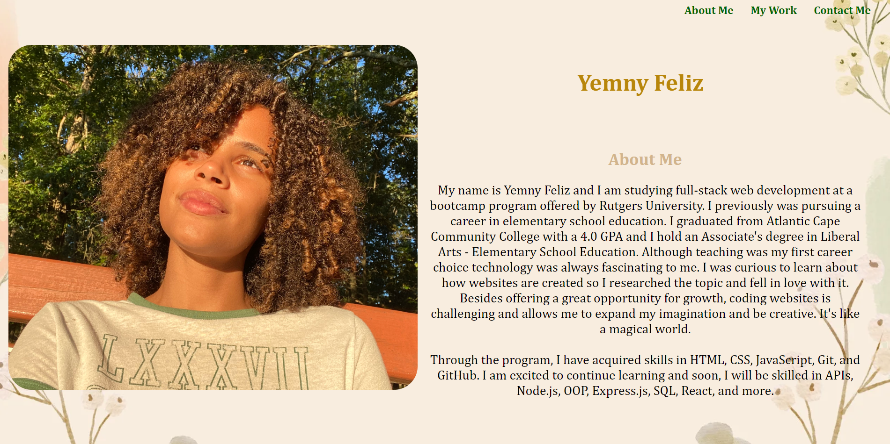

# <"Yemny's Portfolio">

## Description

This is a portfolio website in which I demonstrate my knowledge on HTML and CSS so future employers can see my abilities. The website includes a short paragraph about myself and pictures of projects that I've worked on. When clicked on those pictures, users are taken to the deployed page of the picture. There is also a section with my contact information so if interested, employers can reach out to me.

## Installation

N/A

## Usage

This is a portfolio webpage that employers can use to see my abilities in HTML and CSS and determine if I am a good candidate for the job.

## Credits

I received tutoring from Erik Hoversten.

## License

PLease refer to LICENSE in the repository.

## Tests

The website was made responsive for different portviews. This can be tested by using Chrome Dev tools. It can also be tested in other devices such as tablets and smartphones.